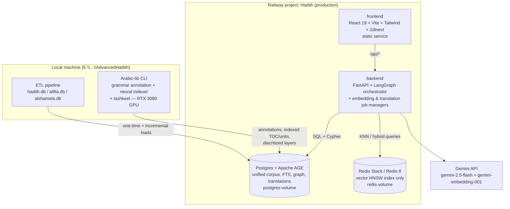
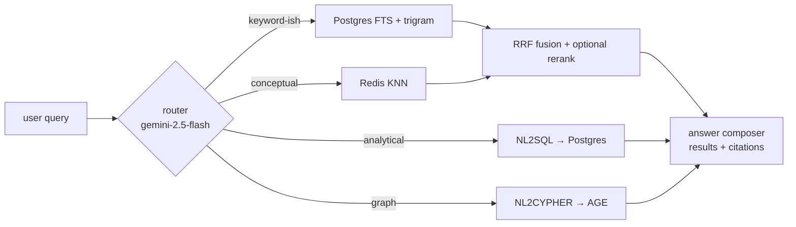

# AdvancedHadith — Requirements & Architecture

**Status: APPROVED (2026-08-19) — all §18 items confirmed; ready to begin Phase 0.
No code has been written yet.**

Version 1.6 — 2026-08-19 (v1.1: AGE approved; KG subset visualization; manual embedding
management; translations/i18n; narrator transliteration; alifta stats downgraded to
reference-design-only. v1.2: Arabic language analysis layer `Arabic-lib` added — Farasa +
CAMeL grammar tools feeding NL2CYPHER linguistic frames and KG generation, §12.
v1.3: AlKhalil2 root-allocation engine integrated, §12.6; automated book indexing
pipeline for flat editions, §12.7. v1.4: staged Farasa Python port with JAR oracles +
engine registry, §12.8; neural page-indexing & tashkeel models with incremental
fine-tuning, §12.9 — confirmed local-only CLI accessories on the RTX 3080 12 GB;
no model runtime in the deployed app. v1.5: ALL APPROVALS RECORDED — languages ar+en
now/64 later; Kalimat.dev-first hadith English translations, §11.6; final color theme,
§10.1. v1.6: third neural model — POS tagging distilled from the Arabic-lib engine
ensemble, §12.9-C)
Location: `E:\Quran Computing Institute\Hadith.chat\AdvancedHadith`
Repo (planned): <https://github.com/mohammadkhair7/Hadith> (databases stay local — see §14.4)
Railway project: `Hadith` (production) — services `backend`, `frontend`, `Postgres`, `Redis`
Decision log: `docs/DECISIONS.md`

---

## 1. Executive summary

AdvancedHadith merges the three corpora built so far — **hadith.db** (sunna.alifta.gov.sa),
**alifta.db** (www.alifta.net archive) and **alshamela.db** (Al-Maktaba Al-Shamela CSV +
PDF) — into one unified **PostgreSQL** knowledge base with:

- **Syntactic search** — full-text keyword search that works **with and without tashkeel**,
  with filters, sorting, and per-book/per-collection scoping.
- **Semantic search** — `gemini-embedding-001` vectors (768-d) stored and queried in
  **Redis** (HNSW vector index; replaces the MongoDB+FAISS pair used in Quran.chat),
  populated **incrementally and manually** through a Book Embedding Management screen
  with idempotent (skip-or-overwrite) re-embedding.
- **NL2SQL + NL2CYPHER** — natural-language questions translated by
  `gemini-3-flash-preview` (`NL_QUERY_MODEL`, falls back to `gemini-2.5-flash` when
  unavailable) into read-only SQL (analytics over the unified schema) and openCypher
  (narrator knowledge-graph queries), with an orchestrator that routes/combines all
  four engines.
- **Narrator knowledge graph (رجال الحديث)** — a persistent, queryable graph (Postgres +
  **Apache AGE**, decision approved) of narrators, isnad chains, teacher/student links,
  and rijāl assessments, visualized as **query-scoped subgraphs with incremental
  expand-on-demand** (never the full graph at once) and rich hover cards.
- **Arabic language analysis layer (`Arabic-lib`)** — one Python library unifying the
  **Farasa** suite (segmentation, POS, NER, diacritization, dependency & constituency
  parsing — staged **true Python port** with the Java JARs as interim engines and
  permanent validation oracles, §12.8), **CAMeL Tools** (morphology, disambiguation,
  NER) and **AlKhalil2** (root allocation/تجذير — its specialty), coordinated by an
  engine registry (primary/fallback/cross-validate per layer); every passage and every
  user question can be annotated with all grammar layers **simultaneously**, grounding
  NL2CYPHER queries (entities pre-resolved to narrator ids) and powering isnad
  extraction for the knowledge graph.
- **Automated book indexing** — a pipeline (built on the same linguistic layers) that
  turns flat page-stream editions (Shamela) into hadith-unit indexed content — TOC tree,
  unit boundaries, hadith numbers, page anchors — validated against the natively-indexed
  matn books, so every book earns the full structured reader experience; **users always
  see processed content, never raw page dumps** (§12.7).
- **Trainable neural models (PyTorch on the local RTX 3080, §12.9)** — a page-indexing
  model (CAMeLBERT-CA token labeling), a tashkeel-generation model (character-level
  Transformer), and a **POS model distilled from the Arabic-lib engine ensemble**
  (Farasa + CAMeL + AlKhalil consensus as ground truth), trained from our own corpora
  with incremental LoRA fine-tuning as reviewed examples accumulate; operated via a
  local CLI as **content-generation accessories** — the deployed application only
  serves their precomputed outputs.
- **Multilingual content** — an i18n framework for the UI plus a **Hadith Translation
  Management** tab: hadith English translations come **Kalimat.dev-first** (authenticated
  sunnah.com-based translations via API, §11.6) with `gemini-2.5-flash` as fallback and
  for all other content; **consistent transliteration** of narrator names. Approved
  scope: Arabic + English now, ~64 more languages later.
- A modern React UI that interconnects readers, search, subjects, takhrij across
  collections, and the graph explorer in one workflow.

Division of labor (per requirement): **Redis = vectors & similarity only; Postgres =
everything else** (relational + full-text + graph via Apache AGE + translations).

---

## 2. Goals and requirements

### 2.1 Functional

| # | Requirement |
|---|---|
| F1 | Ingest all three databases into one unified Postgres schema, preserving source identity and provenance of every text unit. |
| F2 | Keyword search with tashkeel-insensitive matching by default and an "exact (with tashkeel)" mode; filters by collection, book, author, category, subject; sortable result tables. |
| F3 | Semantic similarity search over embedded content using `gemini-embedding-001` vectors in Redis; results interleaved/fused with keyword results; coverage grows book-by-book (F12). |
| F4 | NL2SQL: user questions in Arabic/English answered by generated, validated, read-only SQL with the result table + generated SQL shown. |
| F5 | NL2CYPHER: graph questions (e.g. "من روى عن نافع عن ابن عمر؟") answered via openCypher over the narrator graph (Apache AGE). |
| F6 | Narrator knowledge graph UI: **subset-only rendering** — search/query produces a bounded subgraph; user expands nodes incrementally; hover cards with biography, aliases (kunya/laqab/nasab), transliterated name, grades, teachers/students, narrated hadiths; click-through to hadith reader. Full-graph rendering is explicitly out of scope. |
| F7 | Book reader with TOC navigation for all 130 books; cross-links between the same work in different sources (e.g. الإصابة in sunna and in Shamela). |
| F8 | Subject browser (21,994 subjects / 1.14M links from hadith.db) integrated with search. |
| F9 | Hadith detail page: matn, isnad rendered as a chain/tree, takhrij (same hadith across collections via تحفة الأشراف / إتحاف المهرة atraf data + text similarity). |
| F10 | JWT auth (register/login), optional email via SendGrid; anonymous read access, authenticated features (notes, favourites, saved searches). |
| F11 | Admin/status dashboard: ETL state, embedding coverage, index health. |
| F12 | **Book Embedding Management**: select one or more books, generate chunk embeddings manually/incrementally into Redis; deterministic per-chunk identity guarantees **no duplicate entries** for the same (book, page, chunk) — re-embedding offers **skip** (default) or **overwrite**; live progress, cost estimate, pause/resume. |
| F13 | **Hadith Translation Management**: manually managed translation of content (passages, titles, subjects, narrator bios) into supported languages using `gemini-2.5-flash`; translations stored with status workflow (machine → reviewed → approved) and staleness detection; UI language switcher via i18n framework. |
| F14 | **Narrator transliteration**: every narrator (and alias) carries a consistent romanized form generated under a single transliteration standard; shown in non-Arabic UI locales and in the graph explorer. |
| F15 | **Arabic NLP annotation library (`Arabic-lib`)**: one Python library that evaluates all grammar metadata layers simultaneously (segmentation, POS, NER, diacritization, dependency parsing, constituency parsing, CAMeL morphology, AlKhalil2 root allocation) over books/hadith text and user questions; annotations persisted per passage and used to ground NL2CYPHER and KG generation (§12). |
| F16 | **Automated book indexing**: a manual, per-book, resumable pipeline that converts flat page-stream editions (Shamela imports) into hadith-unit indexed content — heading/TOC-tree detection, hadith-unit segmentation, number reconciliation, page anchoring — validated against natively-indexed duplicates (§12.7), so every book gets the full matn-book reader experience. **Users are served processed content, never raw page dumps** (raw pages remain only as a provenance view). |
| F17 | **Trainable neural models (PyTorch, local RTX 3080 GPU)**: (a) a page-indexing model (CAMeLBERT-CA token labeling) that converts a raw book page into display-ready structure, (b) a tashkeel-generation model (character-level Transformer) that adds diacritics to unvocalized text, and (c) a **POS model** distilled from the Arabic-lib engine ensemble (Farasa + CAMeL + AlKhalil consensus as ground truth) — all trained from our own corpora (dual-source alignment; vocalized/stripped pairs; engine-agreement silver data), with **incremental LoRA fine-tuning** as reviewed examples accumulate, versioned checkpoints, and confidence-driven review. Operated entirely through a **local CLI** (`arabiclib train/finetune/eval/index/diacritize/pos`) as **content-generation accessories — never invoked by the deployed application**, which only serves their precomputed outputs (§12.9). |

### 2.2 Non-functional

- Arabic-first RTL UI, modern look consistent with the Hadith.chat theme (teal/gold family);
  full LTR support when a non-Arabic locale is active.
- P95 keyword search < 500 ms; vector KNN < 300 ms (Redis in-memory); NL2X answers < 8 s;
  graph subgraph fetch (≤300 nodes) < 1 s.
- All LLM-generated queries validated read-only before execution (SELECT-only / MATCH-only).
- All LLM-powered pipelines that cost money (embeddings, translations) are **manual,
  incremental, resumable and idempotent** — never triggered automatically.
- Local dev fully offline-capable except LLM/embedding/translation calls.
- Databases (~GBs) never committed to git.

---

## 3. Source data inventory (measured 2026-08-19, `docs/collect_stats.py`)

| Source | Content | Size |
|---|---|---|
| `data/hadith.db` | 90 books (33 matn + 57 service), **382,583** hadith/page units (~182M chars), 622,658 TOC rows, 21,994 subjects, 1,138,369 subject↔hadith links, FTS5 index | 1.71 GB |
| `Alifta.chat/data/alifta.db` | 40 archived pages (~1.2M chars) incl. narrator statistics tables and 12 deep hadith snapshots; same BookID/MainID space as hadith.db (verified) | 2 MB |
| `Al-Shamela/alshamela.db` | 40 books, **276,635** printed pages (~319M chars), `books` maps hadith book id ↔ Shamela bkid, 4 gap candidates | 1.15 GB |

Cross-source keys already established:
- `Al-Shamela/book_map.py`: hadith book id ↔ (archive, bkid) — verified 100% text overlap on all 7 testable books.
- alifta.net ↔ sunna: identical `(BookID, MainID)` space (comparison report §2, `Alifta.chat/docs/HADITH_ALIFTA_COMPARISON_ARCH.md`).

Especially valuable for the knowledge graph:
- **Rijāl biographies**: الثقات (17k pages), الجرح والتعديل, الإصابة في تمييز الصحابة, تاريخ بغداد, تاريخ الإسلام, تحفة التحصيل.
- **Atrāf indexes**: تحفة الأشراف (28,767 pages) and إتحاف المهرة (31,913 pages) — printed indexes of isnads per hadith, ideal for takhrij and for validating extracted chains.
- **alifta.db statistics pages** (viewrwahstatistics, viewasanidstatistics, viewrwahtabaqat…):
  used **as a reference design only** — they demonstrate proven information layouts and a
  navigation workflow for narrator statistics (counts by collection, tabaqat tables,
  narrator detail drill-down), but their **numbers are not trusted** as ground truth since
  the archived mirror is incomplete. Validation of our graph uses the atrāf books and
  manual audit instead (§9.2 stage 7).

---

## 4. Reference design: what we adopt and improve from Quran.chat

Explored at `F:\Quran.chat\Src-quran_analytics_web_v2\quran_analytics_web` (Flask + React/Vite;
LangGraph orchestrator; Gemini).

| Quran.chat pattern | AdvancedHadith decision |
|---|---|
| Flask backend + React 19/Vite/Tailwind frontend | **Keep React/Vite/Tailwind; switch backend to FastAPI** (async, typed, matches our existing Hadith.chat/Alifta.chat code) |
| MongoDB (`document_embeddings`) as vector source of truth + FAISS `IndexFlatIP` accelerator (+ GridFS cache, remote FAISS microservice) | **Replace both with Redis** (HNSW index, vectors + payload hashes in one store). No separate microservice, no index (de)serialization, no Mongo. Postgres keeps the canonical text; Redis holds vectors + minimal metadata |
| Gemini `gemini-embedding-001` @ 3072-d | Same model @ **768-d** (per project `.env`; 4× cheaper RAM, quality sufficient for retrieval; `task_type=retrieval_document/query`) |
| NL2SQL: LangGraph node, schema summary via PRAGMA + semantic-view YAML, JSON `{enhanced, sql}` output, `_is_safe_select_only` guard, LangChain fallback | **Adopt wholesale**, retargeted to Postgres: schema summary from `information_schema`, semantic view YAML for the unified schema, same SELECT-only guard + auto-repair loop |
| NL2CYPHER: **does not exist** (searched; Maqasid graph is ephemeral NetworkX/PyVis HTML from LLM JSON) | **Design fresh**: persistent graph in Postgres (**Apache AGE — approved**, openCypher), NL2CYPHER prompt with graph schema, MATCH-only guard |
| Maqasid concepts: LLM-extracted nodes/edges rendered via **PyVis** HTML in an iframe — convenient, easy to navigate | Adopt the **workflow** (search → select scope → generate graph → navigate) and **keep a PyVis-style rendering option** for KG search results (§9.3): server renders the *result subgraph* (bounded size) to interactive vis.js/PyVis HTML; primary explorer is a React graph component with incremental expansion |
| Hybrid = query classification (numeric / interpretive / hybrid) with parallel SQL + vector paths merged by LLM synthesis | Adopt the router idea; **add true rank fusion (RRF)** for the retrieval paths in addition to LLM synthesis |
| Arabic policy: strip tashkeel for SQL, preserve for embeddings; dual columns with/without تشكيل | Adopt exactly; our `normalize_arabic` (hamza/ta-marbuta/alef-maqsura unification) is already battle-tested across the three corpora |

A second reference design informs the translation subsystem (§11): the document
translation engine in `F:\Kalimat-DeepCerebra-ExpertAgency\Kalimat-Video-Conferencing-AWS`
(Legal folder multi-language translation) — findings to be appended to §11.5 once its
exploration report is in.

---

## 5. Target architecture



- **backend** (FastAPI): REST API, auth, search orchestrator, NL2SQL/NL2CYPHER agents,
  graph endpoints, and the **job managers** for manual embedding and translation runs
  (resumable job tables in Postgres; workers embedded in the backend service).
- **frontend** (React SPA): served as a static Railway service; `react-i18next` for UI
  locales; language switcher drives both UI strings and content-translation display.
- **Postgres**: unified schema (§6) + `pg_trgm` + full-text + **Apache AGE** (approved)
  for the graph + `translations` store.
- **Redis**: vector index only (§7). Everything else stays in Postgres.
- **ETL runs locally** (the SQLite sources stay local) and pushes to Railway over the
  database's public TCP proxy. Embedding/translation jobs run in the backend (cloud) or
  locally against the same job tables — both paths are idempotent.
- **Arabic-lib** (§12): batch grammar annotation (Farasa Java engines + CAMeL) runs
  locally and persists `passage_annotations` to Postgres; at query time the backend
  builds NL2CYPHER linguistic frames with the pure-Python CAMeL subset + the narrator
  alias lexicon, so no JRE is required in the cloud.

---

## 6. Unified Postgres schema

### 6.1 Design principles

1. **One text-unit table** (`passages`) for all sources — a hadith page from sunna, a
   printed page from Shamela, and an archive page from alifta are all passages with a
   `source` discriminator and source-native identifiers preserved.
2. **Dual text columns**: `text_raw` (with tashkeel, for display + exact mode) and
   `text_norm` (our normalization, for search).
3. **Works vs editions**: one logical *work* (e.g. الإصابة) can have multiple *editions*
   (sunna crawl, Shamela print). This turns today's ad-hoc `book_map.py` into schema.
4. Graph entities (narrators) live in AGE but every graph node mirrors a relational row
   for referential integrity and fast non-graph reads.
5. **Translations are first-class**: any translatable object/field/language triple has one
   row with workflow status and staleness tracking (§11).

### 6.2 Core relational schema (DDL sketch)

```sql
-- provenance
CREATE TYPE source_t AS ENUM ('sunna', 'alifta', 'shamela', 'pdf');

CREATE TABLE works (              -- logical work (the "book" as a concept)
    work_id      serial PRIMARY KEY,
    title        text NOT NULL,          -- canonical Arabic title
    title_norm   text NOT NULL,
    author       text,                   -- canonical author name
    author_norm  text,
    category     text,                   -- متون الحديث / شروح / تراجم / ...
    kind         text NOT NULL           -- matn | sharh | rijal | atraf | lugha | ...
);

CREATE TABLE editions (           -- a concrete copy of a work in one source
    edition_id   serial PRIMARY KEY,
    work_id      int REFERENCES works,
    source       source_t NOT NULL,
    source_book_id int,                  -- hadith.db books.id | shamela bkid | ...
    title        text, betaka text,      -- edition-specific metadata
    pages        int,
    is_primary   boolean DEFAULT false   -- preferred edition for display
);

CREATE TABLE passages (           -- the universal text unit
    passage_id   bigserial PRIMARY KEY,
    edition_id   int REFERENCES editions,
    source_ref   text NOT NULL,          -- 'sunna:1:7387' | 'shamela:32027:4847' | ...
    seq          int NOT NULL,           -- reading order within edition
    part         text, page  text,       -- printed vol/page where known
    hadith_num   text,                   -- explicit hadith number where known
    text_raw     text NOT NULL,
    text_norm    text NOT NULL,
    html         text,                   -- original HTML when available (sunna/alifta)
    tsv          tsvector,               -- GENERATED from text_norm (see 6.3)
    UNIQUE (edition_id, source_ref)
);

CREATE TABLE toc_nodes (          -- unified TOC (622k rows from sunna + derived for shamela)
    toc_id       bigserial PRIMARY KEY,
    edition_id   int REFERENCES editions,
    parent_id    bigint REFERENCES toc_nodes,
    title        text, title_norm text,
    seq          int,
    passage_id   bigint REFERENCES passages   -- leaf → its passage
);

CREATE TABLE subjects (           -- from hadith.db subjects tree
    subject_id   int PRIMARY KEY,
    parent_id    int REFERENCES subjects,
    title        text, title_norm text
);
CREATE TABLE subject_links (
    subject_id   int REFERENCES subjects,
    passage_id   bigint REFERENCES passages,
    PRIMARY KEY (subject_id, passage_id)
);

-- narrators: relational mirror of the graph (§9)
CREATE TABLE narrators (
    narrator_id  serial PRIMARY KEY,
    canonical    text NOT NULL,          -- الاسم المعتمد
    canonical_norm text NOT NULL,
    translit     text,                   -- consistent romanization (§11.4)
    kunya        text, laqab text, nasab text,
    generation   text,                   -- طبقة (صحابي، تابعي، ...)
    death_hijri  int,
    is_sahabi    boolean,
    bio_summary  text                    -- assembled from rijal books
);
CREATE TABLE narrator_aliases (
    narrator_id  int REFERENCES narrators,
    alias        text NOT NULL, alias_norm text NOT NULL,
    translit     text,
    kind         text                    -- name | kunya | laqab | nisba | tahrif
);
CREATE TABLE narrator_assessments (      -- جرح وتعديل
    narrator_id  int REFERENCES narrators,
    critic       text,                   -- ابن حبان، ابن أبي حاتم، ابن حجر ...
    grade        text,                   -- ثقة، صدوق، ضعيف، ...
    quote        text,
    src_passage  bigint REFERENCES passages   -- provenance!
);
CREATE TABLE isnad_chains (              -- one extracted chain per hadith passage
    chain_id     bigserial PRIMARY KEY,
    passage_id   bigint REFERENCES passages,
    position     int NOT NULL,           -- 0 = collector's shaykh ... n = صحابي
    narrator_id  int REFERENCES narrators,
    transmission text,                   -- حدثنا | أخبرنا | عن | سمعت | ...
    raw_segment  text,                   -- exact matched substring (audit)
    confidence   real                    -- extraction confidence 0..1
);

-- translations (§11): one row per object/field/language
CREATE TABLE translations (
    obj_type     text NOT NULL,          -- passage | work_title | subject | narrator_bio | toc_title
    obj_id       bigint NOT NULL,
    field        text NOT NULL,          -- e.g. 'text', 'title', 'bio_summary'
    lang         text NOT NULL,          -- ISO 639-1: en, fr, ur, id, tr, ...
    body         text NOT NULL,
    status       text NOT NULL DEFAULT 'machine',  -- machine | reviewed | approved
    model        text,                   -- e.g. gemini-2.5-flash
    src_hash     text NOT NULL,          -- hash of source text → staleness detection
    translated_at timestamptz DEFAULT now(),
    reviewed_by  int REFERENCES users(user_id),
    PRIMARY KEY (obj_type, obj_id, field, lang)
);

-- job tables for manual, resumable, idempotent pipelines (§7.4, §11.3)
CREATE TABLE embedding_jobs (
    edition_id   int REFERENCES editions,
    passage_id   bigint REFERENCES passages,
    chunk_no     int NOT NULL,
    content_hash text NOT NULL,
    status       text NOT NULL DEFAULT 'pending',  -- pending | embedded | failed | skipped
    embedded_at  timestamptz,
    PRIMARY KEY (passage_id, chunk_no)
);
CREATE TABLE translation_jobs (
    obj_type text, obj_id bigint, field text, lang text,
    status   text NOT NULL DEFAULT 'pending',      -- pending | done | failed
    batch_id uuid, created_at timestamptz DEFAULT now(),
    PRIMARY KEY (obj_type, obj_id, field, lang)
);

-- grammar annotations produced by Arabic-lib (§12)
CREATE TABLE passage_annotations (
    passage_id bigint REFERENCES passages,
    layer      text NOT NULL,   -- segments|pos|ner|diacritized|dependency|constituency|morphology|roots
    engine     text NOT NULL,   -- farasa|camel|alkhalil
    version    text NOT NULL,   -- model/tool version for reproducibility
    payload    jsonb NOT NULL,  -- token-aligned layer data
    created_at timestamptz DEFAULT now(),
    PRIMARY KEY (passage_id, layer, engine, version)
);

-- automated book indexing runs (§12.7): manual, per-edition, resumable
CREATE TABLE indexing_jobs (
    edition_id      int REFERENCES editions,
    indexer_version text NOT NULL,   -- rule-pipeline or neural-model version (§12.9)
    status          text NOT NULL DEFAULT 'pending', -- pending|running|review|done|failed
    stats           jsonb,           -- units found, headings, inferred numbers, confidence histogram
    started_at      timestamptz, finished_at timestamptz,
    PRIMARY KEY (edition_id, indexer_version)
);

-- accumulated supervision for the neural models (§12.9): indexing + diacritization
CREATE TABLE training_examples (
    example_id  bigserial PRIMARY KEY,
    task        text NOT NULL,       -- indexing | diacritization | pos
    source_ref  jsonb NOT NULL,      -- {edition_id, passage_id/page_id, span}
    input_text  text NOT NULL,
    labels      jsonb NOT NULL,      -- BIO tags / per-char diacritic classes / POS tags
    origin      text NOT NULL,       -- auto (dual-source align / engine consensus) | rule | reviewed
    created_at  timestamptz DEFAULT now()
);

-- users (JWT auth)
CREATE TABLE users (
    user_id serial PRIMARY KEY, email text UNIQUE, pw_hash text,
    created_at timestamptz DEFAULT now(), verified boolean DEFAULT false
);
CREATE TABLE user_items (                -- favourites / notes / saved searches
    user_id int REFERENCES users, kind text, ref jsonb, body text,
    created_at timestamptz DEFAULT now()
);
```

### 6.3 Tashkeel-insensitive full-text search

- `text_norm` is produced by the same normalization already used across the three apps:
  strip diacritics (`\u064B-\u065F`, `\u0670`), remove tatweel, unify hamza forms → `ا`,
  `ى→ي`, `ة→ه`. **Queries are normalized identically**, so search works with or without
  tashkeel automatically.
- `tsv` = `to_tsvector('simple', text_norm)` (generated column, GIN index). The `simple`
  config avoids wrong stemming; Arabic morphology is handled by the normalization plus
  prefix matching (`to_tsquery('simple', 'صلا:*')`).
- `pg_trgm` GIN index on `text_norm` for substring/fuzzy matching and "did you mean".
- **Exact mode**: `text_raw LIKE`/regex when the user checks "match tashkeel exactly".
- Snippets/highlighting via `ts_headline`, mapped back onto `text_raw` for display with
  diacritics (offset mapping table built during normalization keeps raw↔norm positions).

### 6.4 Graph layer — Apache AGE (openCypher in Postgres) — **APPROVED**

**Decision (2026-08-19, D1 in `DECISIONS.md`): Apache AGE is the graph layer.** The
Railway Postgres service will be deployed from an AGE-enabled Postgres image attached to
`postgres-volume` (Phase 0 carries out the swap and a restore test). The recursive-CTE
fallback remains documented as a contingency only.

One AGE graph `hadith_graph`:

- **Nodes**: `(:Narrator {narrator_id, canonical, translit, generation, death_hijri})`,
  `(:Hadith {passage_id, hadith_num, edition_id})`, `(:Work {work_id})`,
  `(:Subject {subject_id})`.
- **Edges**:
  - `(:Narrator)-[:NARRATED_FROM {count, books}]->(:Narrator)` — aggregated teacher link
  - `(:Narrator)-[:TRANSMITS_IN {position, transmission}]->(:Hadith)`
  - `(:Hadith)-[:IN_WORK]->(:Work)`, `(:Hadith)-[:ABOUT]->(:Subject)`
  - `(:Narrator)-[:ASSESSED {grade, critic}]->(:Narrator)` (critic → subject)
- Kept **derivable from the relational tables** (rebuildable), so AGE is an index/query
  surface, not a second source of truth.

---

## 7. Vector embeddings in Redis

### 7.1 Chunking & scale

| Decision | Value | Rationale |
|---|---|---|
| Unit | passage, split to ≤ ~1,500 chars with 200-char overlap | sunna passages avg ~475 chars (1 chunk); Shamela pages avg ~1,150 chars (1–2 chunks) |
| Full-corpus ceiling | ~800k vectors | 660k passages + splits — reached only if/when every book is embedded |
| Model / dims | `gemini-embedding-001`, **768-d** (`output_dimensionality=768`), `task_type=retrieval_document` / `retrieval_query` | matches `.env`; 768-d halves RAM vs 1536 and quarters vs 3072 |
| Precision | FLOAT16 in Redis | 800k × 768 × 2B ≈ **1.2 GB** + HNSW overhead ≈ **2–2.5 GB total** at full coverage |
| Embedded text | keep tashkeel, strip only page furniture | Quran.chat lesson: tashkeel carries meaning for embeddings |

### 7.2 Redis layout

Requires the **Redis Query Engine** (Redis 8 image, or `redis/redis-stack-server`) — the
plain `redis` image has no vector search; Phase 0 verifies/redeploys the service.

```
HSET emb:{edition_id}:{passage_id}:{chunk_no}
     vec <float16[768]>  passage_id ...  edition_id ...  work_id ...
     kind ...  source ...  hadith_num ...  content_hash ...

FT.CREATE idx:passages ON HASH PREFIX 1 emb:
  SCHEMA vec VECTOR HNSW 6 TYPE FLOAT16 DIM 768 DISTANCE_METRIC COSINE
         work_id NUMERIC  kind TAG  source TAG  edition_id NUMERIC
```

- **Key = `emb:{edition_id}:{passage_id}:{chunk_no}`** — deterministic identity for every
  (book, page, chunk). Redis `HSET` on an existing key replaces it, so duplicates are
  *structurally impossible*; the skip/overwrite choice (§7.4) is enforced before writing.
- KNN with **pre-filtering** (`@kind:{matn} =>[KNN 50 @vec $q]`) so semantic search
  respects the same filters as keyword search.
- Persistence: AOF + the existing `redis-volume`; the index is also fully rebuildable
  from Postgres + `embedding_jobs`.
- Semantic search transparently reports **coverage**: results carry a notice when the
  current filter scope includes books that are not yet embedded.

### 7.3 Cost control & phasing

Embedding is **never automatic**. ~500M chars ≈ 150–200M tokens at full coverage — a
meaningful spend — so coverage grows only through deliberate operator action in the
Embedding Management screen (§7.4), typically: matn books → rijal books → shurūḥ → rest.
A 1,000-passage pilot in Phase 3 measures quality and calibrates the cost-per-book
estimates shown in the UI.

### 7.4 Book Embedding Management (manual, incremental, idempotent)

An admin screen + API dedicated to operating the embedding pipeline:

- **Coverage table**: one row per edition/book — total passages, chunks, embedded %,
  estimated tokens & cost for the remainder, last run, status.
- **Run flow**: select one or more books → choose **skip existing** (default; only
  chunks whose `(passage_id, chunk_no)` is missing or whose `content_hash` changed are
  embedded) or **overwrite** (re-embed everything selected) → confirm with cost estimate
  → job runs with batch requests, rate limiting, live progress (chunks/sec, ETA),
  pause/resume/cancel.
- **Idempotency**: `embedding_jobs` (Postgres) is the ledger — primary key
  `(passage_id, chunk_no)` with `content_hash`; the Redis key encodes the same identity.
  Re-running a book therefore *never* duplicates entries; unchanged chunks are skipped
  (or explicitly overwritten), and interrupted jobs resume from the ledger.
- **Audit**: every run logged (who, when, books, mode, chunks embedded, tokens, cost).

---

## 8. Search subsystem

### 8.1 Four engines, one orchestrator



- **Router** (LangGraph, as in Quran.chat's orchestrator): classifies the query —
  `lookup | keyword | semantic | hybrid | analytical | graph` — and may split a compound
  question into sub-queries (Quran.chat's `numeric_enhanced` / `interpretive_subquery`
  pattern).
- **Retrieval fusion**: keyword and vector paths always both run for search-type queries;
  results merged with **Reciprocal Rank Fusion** and de-duplicated by passage; optional
  lightweight rerank of the top 50.
- **Everything returns citations** (work, edition, part/page, hadith number) and search
  results deep-link into the reader.

### 8.2 NL2SQL (adopted from Quran.chat, retargeted)

- Model: `gemini-3-flash-preview` (env `NL_QUERY_MODEL`; automatic per-call fallback
  to `LLM_MODEL`/`gemini-2.5-flash` if the preview model becomes unavailable) —
  switched 2026-08-20 for its stronger SQL/Cypher generation. Applies to §8.3 too;
  the router and translation paths stay on `LLM_MODEL`.
- Prompt = role + **schema summary** (generated from `information_schema`, cached) +
  **semantic view YAML** (`docs/semantic_view.yaml`, describing tables/joins/enums in
  Arabic+English) + few-shot examples + question. Output JSON `{enhanced, sql}`.
- Guards: SELECT/WITH-only, single statement, no DDL/DML keywords, `LIMIT` enforced,
  statement timeout 10 s, runs as a read-only Postgres role.
- Error loop: on execution failure, feed error back to the LLM once for auto-repair,
  then fall back to plain retrieval.

### 8.3 NL2CYPHER (new)

- Prompt = AGE graph schema (node labels, edge types, properties, cardinalities) +
  few-shot Cypher pairs (Arabic questions) + question. MATCH/RETURN-only guard,
  depth/complexity caps, **result-size caps** (LIMIT injected; subgraph responses bounded
  per §9.3), read-only role, 10 s timeout, same one-shot repair loop.
- **Arabic linguistic frame (§12.3)**: before generation, the question is annotated with
  `Arabic-lib` (NER + morphology + dependency); person names are pre-resolved to
  `narrator_id`s via the alias lexicon and transmission verbs/direction are detected, so
  the generated Cypher matches by node id instead of fuzzy Arabic strings. The frame is
  additive prompt context — absent or empty frames never block generation.
- Example targets: chains between two narrators, common students of X, all hadiths where
  A narrates from B, shortest isnad from collector to a companion, narrators graded ثقة
  by ابن حبان who narrate in صحيح البخاري.
- Results render as **both** a table and a bounded subgraph in the graph explorer (§9.3).

### 8.4 Syntactic search UX

- Single search box; normalization makes tashkeel optional transparently.
- Toggles: exact-tashkeel mode, whole-word vs prefix, scope (collections/books/kinds),
  subject filter; sortable, paginated result table with snippet highlighting.

### 8.5 Multi-dimensional classification facets (implemented 2026-08-20)

Two additional classification dimensions, both queryable in keyword/exact search
(`transmission=`, `hadith_type=` params) and shown as chips on the passage page;
`GET /classify/taxonomy` serves the facet lists with corpus counts.

1. **Means of transmission (طرق التحمل)** — derived at query time from
   `isnad_links.verb` (already populated by the chain extractor, including
   copyists' abbreviations ثنا/نا/انا/ابنا):
   - سماع: حدثنا، حدثني، ثنا، نا، سمعت، سمع (~336K chains)
   - إخبار: أخبرنا، أخبرني، انا، ابنا (~93K)
   - إنباء: أنبأنا، أنبأ (~16K)
   - عنعنة: عن (~235K)
   Mapping lives in `backend/app/services/classify.py::TRANSMISSION_CLASSES`;
   a raw verb form is also accepted as its own filter value.
2. **Hadith type (نوع الحديث)** — rule classifier v0.1
   (`classify_hadith_type`) over the sanad tail + matn head (the attribution
   «عن النبي ﷺ قال» usually sits at the end of the sanad), with narrator
   generation (صحابي/تابعي) as fallback signal. Stored in `hadith_types`
   (populated by `ops/classify_hadith_types.py`, idempotent, local+Railway).
   Corpus distribution (257,094 chains → 192,458 classified, 75%):
   qudsi 1,712 · marfu_qawli 89,130 · marfu_fili 34,340 · marfu 60,144 ·
   mawquf 695 · maqtu 6,437. «قال الله : ﴿…﴾» is guarded as Quran citation,
   not قدسي. Taxonomy follows the alifta.net نوع الحديث tree
   (`Alifta.chat/data/raw/viewsubjecttree.html`, `definitions.html`).

Chapter/topic categorization (the third dimension) was already served by the
`subjects`/`subject_links` load from hadith.db (21,994 subjects, 1.14M links):
subject tree browse, per-passage subject chips, and `subject_id=` search filter.

---

## 9. Narrator knowledge graph (رجال الحديث) — construction plan

### 9.1 Why our data is enough

- **Isnad text**: 382k sunna passages carry classical isnads with regular transmission
  verbs (حدثنا/أخبرنا/عن/سمعت/قال) — highly parseable.
- **Biographies**: dedicated rijāl books totalling ~50k pages (الثقات، الجرح والتعديل،
  الإصابة، تاريخ بغداد، تاريخ الإسلام، تحفة التحصيل) give canonical names, generations,
  death dates, assessments.
- **Atrāf indexes** (تحفة الأشراف، إتحاف المهرة) cross-list isnads per hadith across the
  six books — the validation set for extracted chains and the backbone for takhrij.
- **alifta.net statistics pages**: **reference design only** (layouts + drill-down
  workflow for narrator statistics); their counts are not used for validation because the
  archived mirror is incomplete.

### 9.2 Pipeline (each stage persisted, auditable, resumable)

| Stage | Method | Output |
|---|---|---|
| 1. Sanad segmentation | rule-based split of matn head until matn-start markers (قال رسول الله…), using transmission verbs | sanad substring per passage |
| 2. Chain parsing | grammar of verb + name segments; LLM (`gemini-2.5-flash`, JSON mode) only for the ambiguous residue (~10–20%) | ordered name list + verbs, confidence |
| 3. Mention normalization | `normalize_arabic` + strip honorifics (رضي الله عنه…) | clean mention strings |
| 4. Entity resolution | (a) exact/alias match against narrator lexicon seeded from rijāl books; (b) blocking + fuzzy (trigram) + context features (teacher/student co-occurrence, generation constraints); (c) LLM adjudication for hard cases; every merge keeps provenance | `narrators`, `narrator_aliases`, mention→narrator links |
| 5. Bio assembly | retrieve rijāl passages mentioning the narrator (FTS + vectors), extract structured facts (kunya, death year, grades with critic + quote + source passage) via LLM, store with `src_passage` provenance | `narrator_assessments`, `bio_summary` |
| 6. Graph build | aggregate chains → `NARRATED_FROM` edges with counts/books; load nodes/edges into AGE; generate transliterations (§11.4) | `hadith_graph` |
| 7. Validation | atrāf cross-checks; spot-check famous chains (نافع→ابن عمر, الأعمش→أبي صالح…); 200-hadith manual audit sample per collection; sample audit UI | quality report |

Seeding shortcut: start the lexicon from الإصابة (companions, 12k+ entries) and الثقات /
الجرح والتعديل entry headers — these books are *structured as dictionaries*, so their TOC
titles are already narrator names (622k TOC rows include them).

Stages 1–5 are upgraded by the `Arabic-lib` grammar layers (constituency for sanad/matn
boundaries, POS+NER+dependency for chain parsing, diacritization for homographic names,
morphology features for entity resolution) — see §12.4 for the stage-by-stage mapping.

### 9.3 Graph UI — subset-only, incremental exploration

**Principle (D2): the full KG is never rendered.** All graph views are *query-scoped
subgraphs* with hard caps, built for fast compute and a manageable picture:

- **Entry points**: narrator search, a hadith's isnad, an NL2CYPHER result, or a saved
  view. The backend returns a bounded subgraph (default cap ~150 nodes, hard cap ~300;
  server-side truncation with "N more hidden" markers).
- **Incremental expansion**: every node shows its hidden-neighbor count; clicking
  **expands on demand** (lazy `MATCH (n)-[r]-(m) … LIMIT k` fetch), appending to the
  canvas. Collapse/undo/breadcrumbs keep the view tidy; degree-sorted expansion brings
  the most connected neighbors first.
- **Primary renderer**: React graph component (`react-force-graph` WebGL or Cytoscape.js —
  Phase 6 spike decides) with custom hover cards: canonical name + transliteration,
  kunya/laqab, generation, death year, top grades with critic quotes (cited), counts
  (hadiths, teachers, students), aliases; click → side panel / narrator page.
- **PyVis-style HTML view — supported (per review request)**: any current subgraph can be
  rendered server-side to a standalone interactive vis.js/PyVis HTML (same physics/hover
  behavior as Quran.chat's Maqasid graphs) and shown in an embedded frame or downloaded
  as a self-contained file for sharing. Because it always receives the *bounded result
  subgraph* (never the full KG), it stays fast to compute and easy to navigate.
- **Filters**: generation/tabaqa, grade, book/collection, edge-weight threshold;
  path-finding mode between two selected narrators.

---

## 10. Application UI (screens)

| Screen | Content |
|---|---|
| Home | global search, collection tiles, corpus stats, recent activity |
| Unified search | tabs: الكل / نصوص (fused keyword+semantic) / تحليلات (NL2SQL) / الرواة (NL2CYPHER + graph); filters sidebar; sortable tables; generated SQL/Cypher shown collapsibly |
| Reader | TOC tree + passage view (tashkeel display), edition switcher for multi-edition works, prev/next, subjects chips, "find in Shamela/sunna" cross-link, translation display when available (§11) |
| Hadith detail | matn, isnad chain visual (mini-graph), takhrij panel (same hadith across collections), grades of chain narrators |
| Narrator explorer | bounded graph canvas + incremental expansion + hover cards + side panel (full bio, hadith list, assessments table); PyVis-style HTML export |
| Subjects | tree browser → passages, with search-within-subject |
| Compare | side-by-side same-work editions (sunna vs Shamela) with diff highlighting |
| Account | favourites, notes, saved searches (JWT) |
| **Admin › Status** | ETL progress, index health, extraction quality metrics |
| **Admin › Embedding Management** | per-book embedding coverage, cost estimates, run/pause/resume jobs, skip/overwrite mode (§7.4) |
| **Admin › Hadith Translation Management** | per-book × per-language translation coverage, start translation batches, review/approve queue, staleness report (§11.3) |

### 10.1 Color theme (approved, final)

Two palettes, both defined as Tailwind tokens and CSS variables:

**Primary UI palette** — chrome, navigation, readers, cards, buttons:

```js
// tailwind.config.js
colors: {
  'islamic-teal':  '#0D7377',   // primary brand / links / active states
  'islamic-gold':  '#D4AF37',   // highlights, hadith numbers, accents
  'islamic-dark':  '#1A1A2E',   // dark-mode surfaces / headings
  'islamic-light': '#F8F9FA',   // light-mode background
  'deep-teal':     '#14213D',   // headers, sidebars, footer
  'orange-accent': '#FCA311',   // calls-to-action, warnings, badges
}
```

**Neon data-visualization palette** — charts, analytics (NL2SQL result plots), graph
explorer node/edge coloring, embedding/translation coverage dashboards:

```css
:root {
  --neon-green:#10b981; --neon-blue:#3b82f6; --neon-red:#ef4444;
  --neon-yellow:#facc15; --neon-orange:#f59e0b; --neon-cyan:#22d3ee;
  --neon-pink:#ec4899; --neon-purple:#8b5cf6;
  --bg-dark:#0a0a0a; --bg-secondary:#1a1a1a;
  --text-primary:#ffffff; --text-secondary:#e5e7eb;
}
```

Usage rules: light/dark modes built from the primary palette (`islamic-light` ↔
`islamic-dark`/`--bg-dark` surfaces); the neon palette is reserved for data encodings
(chart series, KG node categories by generation/tabaqa, edge weights, status
indicators) so data visuals stay legible on both modes; Arabic-first RTL with mirrored
LTR layouts for non-Arabic locales. Matplotlib exports (if any server-rendered plots)
use the same NEON_* constants.

---

## 11. Translations, internationalization, transliteration

### 11.1 Two layers

1. **UI strings (i18n)**: `react-i18next` locale bundles (`ar` default; `en` at launch;
   more per `SUPPORTED_LANGUAGES`). Static, versioned in git, translated once per release.

**Language scope (approved)**: `SUPPORTED_LANGUAGES = ar, en` for now. **~64 additional
languages will be added later** — the design already accommodates this (translations
keyed by `lang`, locale bundles per language, coverage matrix scales horizontally), so
adding a language is configuration + translation batches, not schema or code changes.
2. **Content translations**: passages, work/TOC titles, subjects, narrator bios —
   millions of Arabic strings. Stored in the `translations` table (§6.2), produced
   **manually** via the Translation Management tab, displayed by the same language
   switcher: when the active locale has an `approved` (or, optionally, `machine` with a
   visible "آلي/MT" badge) translation for the object on screen, it is shown alongside or
   instead of the Arabic per user preference; otherwise graceful fallback to Arabic.

### 11.2 Translation engine (gemini-2.5-flash)

- **Hadith English translations follow a Kalimat-first waterfall (§11.6, approved)**:
  the Kalimat.dev API is queried first for an authenticated scholarly translation
  (sunnah.com-based); `gemini-2.5-flash` is the fallback when Kalimat has no match.
  Everything below applies to the Gemini path (and to non-hadith content generally).
- Chunked translation with a system prompt enforcing: faithful rendering of classical
  Arabic, preservation of hadith technical terms (with a provided glossary: isnad, matn,
  ṣaḥīḥ…), untranslated Qur'anic quotations kept in Arabic with translation in brackets,
  and consistent narrator name handling via the transliteration lexicon (§11.4) so the
  same narrator is spelled identically across the entire corpus.
- Long passages split on sentence boundaries with overlap-free reassembly; formatting
  (paragraphs, numbering) preserved.
- `src_hash` staleness: if a source passage is later corrected, its translations flip to
  a "stale" state in the management tab for selective re-translation.
- Reference design: the Legal-documents translation engine in
  `F:\Kalimat-DeepCerebra-ExpertAgency\Kalimat-Video-Conferencing-AWS` — its prompt
  structure, language configuration and output-per-language conventions inform this
  design; **§11.5 records the findings** from its exploration.

### 11.3 Hadith Translation Management tab (manual workflow)

- **Coverage matrix**: books × languages, showing translated %, status split
  (machine/reviewed/approved), stale count, estimated cost for the remainder.
- **Run flow**: select books (or subjects/passage ranges) × target languages → cost
  estimate → confirm → batch job (`translation_jobs` ledger; resumable, idempotent by
  `(obj_type, obj_id, field, lang)` primary key — re-runs **skip existing** unless
  **overwrite** is chosen, mirroring the embedding policy).
- **Review queue**: side-by-side Arabic/translation editor; approve/edit/reject;
  reviewer identity recorded; approved rows locked against overwrite (must be explicitly
  unlocked).
- Nothing translates automatically; every batch is operator-initiated.

### 11.4 Narrator name transliteration (consistent)

- **Standard**: simplified ALA-LC romanization of Arabic (scholarly convention:
  ʿAbd al-Raḥmān, Ibn Ḥajar, al-Bukhārī), with a project style sheet fixing the
  ambiguous cases (assimilation of ال, ة endings, ibn/bin, أبو → Abū).
- **Generation**: deterministic rule engine for the regular cases + `gemini-2.5-flash`
  constrained by the style sheet for irregular names; every result cached in
  `narrators.translit` / `narrator_aliases.translit`; a **single lexicon** guarantees the
  same Arabic name never gets two spellings.
- **Review**: transliterations appear in the Translation Management tab as their own
  "language" column (`translit`) with the same review/approve workflow.
- **Usage**: graph hover cards and narrator pages in non-Arabic locales; search accepts
  transliterated input (matched via the lexicon back to Arabic forms).

### 11.5 Kalimat reference findings (explored 2026-08-19)

The Legal-documents translation engine in
`F:\Kalimat-DeepCerebra-ExpertAgency\Kalimat-Video-Conferencing-AWS` was examined. How it
works, and what AdvancedHadith adopts vs improves:

| Kalimat pattern | Finding | AdvancedHadith decision |
|---|---|---|
| Invocation | Offline Node CLI scripts (`scripts/translate-html-v2.js`, `translate-legal.js`, `retranslate-user-guide.js`, …), no API/UI | **Improve**: same operator-initiated spirit, but exposed as the Translation Management tab + job API (§11.3) instead of ad-hoc scripts |
| Models | Gemini family (`gemini-2.5-flash` for chunked/user-guide runs; pro variants with fallback for one-shot documents), temperature ~0.1 | **Adopt**: `gemini-2.5-flash`, low temperature; model recorded per row in `translations.model` |
| Prompt style | "Professional legal translator" role + hard structure-preservation rules (keep tags/classes/URLs/amounts, set `lang`/`dir`, no code fences) | **Adopt**, retargeted to classical-Arabic hadith rules + glossary + transliteration lexicon (§11.2) |
| Chunking | Whole-document for short files; ~250-line chunks split at safe boundaries and reassembled for long ones | **Adopt**: sentence-boundary chunking per passage; passages are naturally small |
| Language config | `supportedLanguages.json` (66 langs: code, name, nativeName, dir) driving both UI and scripts | **Adopt** the single-source language registry idea → `SUPPORTED_LANGUAGES` env + one JSON registry consumed by frontend and job runner |
| Output storage | Filesystem `Legal/<lang>/<same-filename>.html`, no DB | **Improve**: `translations` table (§6.2) — content is data, not files; enables coverage matrix, review states, per-passage granularity |
| Review workflow | Manual/operational (edit English → re-run; `--force`; counsel review noted in docs; audit scripts) | **Improve**: explicit machine→reviewed→approved states with reviewer identity and locked approvals (§11.3) |
| Dedup / staleness | File-existence / mtime / marker-comment heuristics; `--force` to re-translate; **no content hashing** | **Improve**: `src_hash` per translation row — deterministic staleness detection; skip/overwrite semantics identical to embeddings (D3/D4) |
| Frontend i18n | Custom `I18nContext` + per-locale JSON (not react-i18next) | Either works; we keep **react-i18next** for ecosystem tooling (extraction, pluralization, RTL helpers), same per-locale JSON shape |

Net: Kalimat validates the manual, Gemini-driven, structure-preserving approach at 66
languages; our design upgrades its weakest points (no DB, no hashing, no review states)
with the `translations`/`translation_jobs` schema.

### 11.6 Kalimat.dev API — authenticated hadith English translations (approved)

(Distinct from §11.5: that section covers the Kalimat *legal-documents translation
engine* as a design reference; this one covers the **Kalimat.dev public API** as a live
translation *source*.)

**Waterfall for each hadith passage → English** (inside the same manual translation
batches, D4):

1. **Kalimat lookup**: `GET https://api.kalimat.dev/search` with the hadith's Arabic
   matn (URL-encoded), `getText=2`, `getTotalResultsNum=1`, and — required for hadith —
   `indexes=[%22sunnah_lk%22]` (quotes URL-encoded; for Qur'anic verse lookups the
   `indexes` parameter must be **omitted** and `getText=1` used instead — including it
   causes 500 errors). Auth header `X-Api-Key` from `KALIMAT_API_KEY` (already present
   in `E:\Quran Computing Institute\Hadith.chat\.env`).
2. **Match verification**: a returned result is accepted only if `en_text` is non-empty
   **and** the returned Arabic `text` passes a normalized-similarity check against our
   matn (trigram/token overlap above threshold) — this guards against the search
   returning a *different* hadith than the one being translated.
3. **Accept**: store `en_text` in `translations` with `translation_source='kalimat'`,
   plus provenance metadata (`kalimat_id`, `source_book`, `hadith_number`, `grade_en`);
   these enter the review workflow pre-marked **authenticated** (sunnah.com-derived
   scholarly translations) and are prioritized over machine output.
4. **Fallback**: no result / no `en_text` / failed similarity check / API error →
   translate with `gemini-2.5-flash` (§11.2), `translation_source='gemini-2.5-flash'`,
   normal `machine` status.

Implementation notes:
- Responses cached (keyed by matn hash) so re-runs and overlapping batches never re-query;
  failures logged per the reference error-handling table (timeout → skip & continue).
- Rate-limited client with retries; the job ledger records which source produced each row,
  so coverage reports can show "authenticated vs machine" percentages per book.
- Reference implementation:
  `F:\Quran.chat\Src-quran_analytics_web_v2\quran_analytics_web\backend\tests`
  (`test_kalimat_api.py`, `test_kalimat_rag_workflow.py`) and
  `docs\KALIMAT_API_DOCUMENTATION.md` in the same project (v1.1, incl. the Quran-vs-
  hadith parameter differences and failure-mode table).

---

## 12. Arabic language analysis layer — `Arabic-lib`

Location: `E:\Quran Computing Institute\Hadith.chat\AdvancedHadith\Arabic-lib` (planned).
Tool sources: `AdvancedHadith\Grammar` — **Farasa** suite (QCRI) and **CAMeL Tools**
(NYU Abu Dhabi, `camel_tools-master`).

### 12.1 What is actually in `Grammar` (inspected 2026-08-19)

| Tool | Technology | Contents |
|---|---|---|
| Farasa-Segmenter-Jar | **Java** (NetBeans/Ant project) | `com.qcri.farasa.segmenter.*`, serialized models (`.ser`), CLI launchers (`farasasegmenter.sh/.bat` → `java -jar dist/FarasaSegmenterJar.jar`) |
| Farasa-Parts-of-Speech-Jar | Java | POS tagger + launchers |
| Farasa-Named-Entity-Recognizer-Jar | Java | NER (persons/locations/organizations) |
| Farasa-Diacritize-Jar | Java | diacritizer (adds tashkeel) |
| Farasa-Dependency-Parser | Java | dependency parser; deps: `mallet.jar`, `weka.jar`, `trove.jar` |
| constituency-parser | Java | constituency parser + `farasa-models` |
| camel_tools-master | **Python** | modules: `morphology`, `disambig`, `tokenizers`, `tagger`, `ner`, `dialectid`, `sentiment`, `utils` |
| alkhalil_nlp | **Python** (Java→Python conversion) | AlKhalil Morpho Sys 2 (Oujda NLP team): morphological analyzer that **excels at root allocation (تجذير)** — voweled/unvoweled analysis, clitic segmentation, pattern (وزن) matching, POS, proper-noun analyzer, diacritics generation; utils for normalization/indexation/search; FastAPI + Streamlit shells. See §12.6 for integration and caveats. |

**Correction to the review note**: the Farasa tools are **Java** (JAR/Ant/NetBeans), not
JavaScript. Because Farasa's quality is the benchmark we want to keep (user directive),
the plan targets a **true Python port** delivered in stages (§12.8): first JAR wrappers
behind a pure-Python API (immediate capability), then per-tool Python ports made
feasible by **exporting the Java-serialized models (`.ser`) to portable formats** and
reimplementing the inference algorithms in Python — with the JARs retained permanently
as validation oracles. Ported and wrapped engines coexist in an engine registry with
**primary / fallback / cross-validate** roles per tool. (D7 as amended by D9 in
`DECISIONS.md`.)

### 12.2 `Arabic-lib` design

```
Arabic-lib/
  arabiclib/
    __init__.py            # annotate(text, layers=[...]) -> Annotation
    schema.py              # dataclasses: Token, Segment, Entity, DepArc, TreeNode, Annotation
    normalize.py           # the project-standard normalization (shared with ETL)
    engines/
      base.py              # Engine protocol: warm(), annotate_batch(texts) -> layer dict
      registry.py          # per-layer engine roles: primary / fallback / cross-validate (§12.8)
      farasa_jar/          # ┐ JVM-backed engines (interim + permanent validation oracle):
        segmenter.py       # │ one persistent JVM via JPype
        pos.py  ner.py     # │ (fallback: long-lived stdin/stdout pipe to `java -jar`,
        diacritize.py      # │  NEVER per-call subprocess — JVM startup ≈ seconds)
        dependency.py      # │
        constituency.py    # ┘
      farasa_py/           # ┐ TRUE PYTHON PORTS (§12.8): inference reimplemented in
        segmenter.py       # │ Python/NumPy over models exported from the .ser files;
        pos.py  ner.py     # │ promoted to primary per tool once output parity with the
        diacritize.py      # │ JAR passes the fidelity gate (≥99.5% token agreement)
        dependency.py      # ┘
      camel_morphology.py  # ┐ pure-Python engines (CAMeL Tools as a dependency)
      camel_disambig.py    # │ lemmas, roots, patterns, full morpho features
      camel_ner.py         # │ transformer NER (CAMeLBERT)
      camel_tokenizer.py   # ┘
      alkhalil_root.py     # AlKhalil2 root allocation + pattern/POS (pure Python, §12.6)
      neural_indexer.py    # ┐ PyTorch models (§12.9): page-structure labeling,
      neural_diacritizer.py# │ tashkeel generation, and POS tagging distilled
      neural_pos.py        # ┘ from the engine ensemble
    export/                # one-time Java model exporters (.ser -> JSON/NPZ) (§12.8)
    models/                # exported Farasa models + trained PyTorch checkpoints (gitignored)
    pipeline.py            # batch runner over passages; writes passage_annotations
    isnad.py               # isnad-specific heuristics built on the layers (§9.2)
    training/              # §12.9: dataset builders, train/eval scripts, PEFT configs
    indexing/              # automated book indexing pipeline (§12.7)
      headings.py          # structural heading detection (كتاب/باب/فصل …)
      units.py             # hadith-unit segmentation (isnad-start / matn-end)
      numbering.py         # hadith-number extraction & reconciliation
      tocbuild.py          # synthetic TOC-tree assembly + page mapping
  jars/                    # built Farasa dist JARs + models (gitignored if large)
  tests/                   # golden files over hadith samples
  README.md
```

- **Unified annotation call**: one invocation evaluates **all requested layers
  simultaneously** — segmentation, POS, NER, diacritization, dependency arcs,
  constituency tree, CAMeL morphology (lemma/root/pattern) — and returns a single
  `Annotation` object with token-aligned layers (all layers indexed against one master
  token sequence; alignment shims reconcile Farasa vs CAMeL tokenizations).
- **Performance model**: engines are warmed once (persistent JVM / loaded CAMeL DBs) and
  fed **batches**; the corpus pipeline streams passages from Postgres and writes
  annotations back — resumable via the same job-ledger pattern as embeddings (D3).
- **Storage**: `passage_annotations (passage_id, layer, engine, version, payload jsonb,
  PRIMARY KEY (passage_id, layer, engine, version))` — annotations are data, queryable
  by NL2SQL too (e.g. "أكثر الأعلام وروداً في كتاب كذا" via the NER layer).

### 12.3 How the grammar layers improve NL2CYPHER (the main payoff)

The weakness of naive NL2Cypher is that the LLM must guess entity names and relation
intent from raw Arabic. `Arabic-lib` turns the user's question into a **structured
linguistic frame** *before* Cypher generation:

```
question (Arabic)
  → Arabic-lib annotate (segmenter, POS, CAMeL morphology, NER, dependency)
  → frame {
      entities:  NER person spans → resolved against narrator_aliases lexicon
                 → candidate narrator_ids (with confidence)
      relations: transmission verbs (حدثنا/أخبرنا/عن/سمع) + dependency arcs
                 → intent: NARRATED_FROM / TRANSMITS_IN / ASSESSED
      constraints: morphology-normalized keywords (روى/يروي/رووا → root ر-و-ي),
                 generation/tabaqa words, book names → work_ids
    }
  → NL2CYPHER prompt = graph schema + few-shots + question + FRAME
  → Cypher grounded on real node ids (MATCH (n:Narrator {narrator_id: 4711}) ...)
```

Concretely:
- **Entity grounding**: names in the question are pre-resolved to `narrator_id`s via the
  alias lexicon (with diacritization applied first when the question is unvocalized and
  ambiguous — e.g. عُمَر vs عَمْرو), so generated Cypher matches by id, not by fuzzy string.
- **Relation detection**: dependency arcs between the transmission verb and its
  subject/object indicate direction (من روى **عن** فلان vs من روى **عنه** فلان).
- **Morphological expansion**: CAMeL lemma/root lookup lets one few-shot rule cover all
  inflections of روى/حدث/أخبر without enumerating surface forms.
- **Fallback**: if the frame resolves nothing (non-graph question), the router simply
  proceeds without it — the frame is additive context, never a gate.

### 12.4 How the grammar layers improve KG generation (upgrades to §9.2)

| §9.2 stage | Upgrade with Arabic-lib |
|---|---|
| 1. Sanad segmentation | constituency + punctuation-free clause detection locate the sanad/matn boundary more reliably than markers alone |
| 2. Chain parsing | POS + NER + dependency identify name spans and transmission verbs structurally; the LLM residue shrinks from ~10–20% to the truly ambiguous rump |
| 3. Mention normalization | diacritizer output stored alongside raw mention disambiguates homographic names (عُمَر/عَمْرو, حَسَن/حُسَين) |
| 4. Entity resolution | morphology features (nasab patterns ابن/أبو/nisba endings) + NER type as blocking features; alias lexicon enriched with diacritized variants |
| 5. Bio assembly | NER over rijāl pages pre-extracts person/place/date spans for the fact extractor |

### 12.5 Deployment split

- **Batch annotation runs locally** (like the ETL): the JVM engines need Java only on the
  local machine; results land in Postgres. The cloud never requires a JRE for this.
- **Query-time frame building runs in the backend** using the **pure-Python subset**
  (CAMeL morphology/NER + the narrator alias lexicon from Postgres); the Farasa
  diacritizer is exposed to the backend only if we deploy an optional `nlp-worker`
  service (JRE image) — decision deferred until Phase 5 measures whether CAMeL-only
  frames are sufficient at query time.
- Licensing check in Phase 5: Farasa is QCRI-licensed (research use terms) — confirm
  the intended use before any public deployment; CAMeL Tools is MIT.
- **Neural models (§12.9) are local-only accessories**: trained and run via CLI on the
  local RTX 3080; the deployed application never invokes them — it serves their
  precomputed outputs from Postgres. No GPU (and no model runtime) exists on Railway.

### 12.6 AlKhalil2 (`Grammar\alkhalil_nlp`) — the root-allocation engine

AlKhalil Morpho Sys 2 (Oujda NLP team) is already Python (a Java→Python conversion) and
**excels at root allocation (تجذير)** — assigning the correct trilateral/quadrilateral
root to Arabic words — plus pattern (وزن) identification, clitic segmentation, voweled
and unvoweled analysis, and a dedicated **proper-noun analyzer**
(`impl/PropernounAnalyzerImpl.py`) directly useful for narrator-name analysis.

**Role in `Arabic-lib`** (adapter `engines/alkhalil_root.py`):
- **Primary root layer**: AlKhalil2 root allocation becomes the authoritative `root`
  field in the morphology layer, cross-checked against CAMeL's analyzer; disagreements
  are flagged for the disambiguator (two independent engines make root assignment far
  more reliable than either alone).
- **Root-indexed search**: roots stored per token in `passage_annotations` enable
  root-based query expansion in keyword search (find رَوى، يَروي، رُواة، مَرويّات from one
  root ر-و-ي) — a stronger version of the stemming used in FTS.
- **NL2CYPHER frames (§12.3)**: root + pattern features feed the morphological-expansion
  step; the proper-noun analyzer adds a second signal for person-name detection alongside
  Farasa/CAMeL NER.
- **Indexing pipeline (§12.7)**: heading keyword classification is done on roots, not
  surface forms (كتاب/كتب/الكتاب collapse to ك-ت-ب).

**Integration caveats found on inspection (2026-08-19):**
- The `resources/` folder (`Data.root` lexical databases the analyzer loads at startup)
  is **not present** in the copy under `Grammar` — the AlKhalil2 linguistic resources
  must be obtained (upstream distribution) or the XML loaders in `util/xml/` pointed at
  them before the engine runs. Tracked as a Phase 5 setup task.
- The conversion was GPT-assisted (per file docstrings); several utility modules are
  skeletal (e.g. `util/Indexation.py` is a simplified word-position indexer). Phase 5
  includes a **validation pass**: golden tests comparing root output against published
  AlKhalil2 results on a standard word list before the engine is trusted.
- The FastAPI/Streamlit shells wrapped around each module are dropped; `Arabic-lib`
  imports the analyzer classes directly as a library.
- **Security**: `Grammar\alkhalil_nlp\.env` contains a **live OpenAI API key** — rotate
  it and ensure `Grammar/**/.env` is gitignored before the repo's first commit (§15).

### 12.7 Automated book indexing — from flat pages to structured hadith display

**How the matn books got their per-hadith display (the model to replicate).**
The sunna.alifta.gov.sa matn books did not need indexing on our side — the source was
*born indexed*, and the crawl preserved that structure in `hadith.db`:

| Structure | Contents | What it enables in the UI |
|---|---|---|
| `toc` tree | 622,658 nodes (`node_id`, `parent_id`, `title`, `is_leaf`, `ord`) — the full كتاب → باب hierarchy per book; **leaf nodes point at individual hadith units** | sidebar TOC navigation; breadcrumbs (book → kitāb → bāb) above every hadith |
| `matn` units | 382,583 rows keyed by `main_id` — **one row = one hadith/logical unit**, not one printed page — with `hadith_num` (263,960 filled), `part_page` (جزء/صفحة like `1/7`), `prev_id`/`next_id` chaining | one-hadith-per-screen reader; hadith numbering; print-edition citation; next/previous navigation in reading order |
| `subjects` + `subject_hits` | 21,994 thematic subjects, 1,138,369 subject→(book, main_id) links | subject browser; "related by topic" cross-links on every hadith |

The lesson: the display quality comes from the text being addressed at the **hadith
unit** level with hierarchy, numbering, page anchors and sequence — exactly what the
Shamela imports lack. `alshamela.db` pages are a **flat page stream**
(`bkid`, `page_id`, `part`, `page`, `hno`, `sora`, `aya`, `nass`): headings sit inline in
the text, one page can hold several hadiths, one hadith can span pages. (One head start:
Shamela's `hno` column already carries a hadith number for many rows.)

**Automated indexing pipeline (planned, `arabiclib.indexing`).** For each un-indexed
edition, produce the same target structures (§6.2 `toc_nodes` + hadith-unit `passages`
with `page_from/page_to` anchors) from raw pages:

| Stage | Method | Linguistic tools used |
|---|---|---|
| 1. Heading detection | classify lines/spans as structural headings vs body: lexical cues (كتاب، باب، فصل، ذكر، مسألة…) matched **by root** (AlKhalil2) so surface variants collapse; position/length/typography heuristics; short headline-grammar check (POS: nominal phrase, no verb) | AlKhalil2 roots, Farasa POS |
| 2. Heading-level inference | assign hierarchy depth (كتاب > باب > فصل) from the cue lexicon + numbering patterns (باب ١، الفصل الثاني) + document order | numbering grammar (`numbering.py`) |
| 3. Hadith-unit segmentation | split body text at hadith starts: isnad-opening patterns (transmission verb حدثنا/أخبرنا/عن + person entity within the first tokens) and matn-end markers; validated against the §9.2 sanad segmenter (same components, reused) | Farasa NER + dependency, CAMeL morphology, `isnad.py` |
| 4. Numbering reconciliation | attach hadith numbers: Shamela `hno` when present → inline numerals at unit starts → sequential fallback (flagged `inferred`); collisions and gaps reported | `numbering.py` |
| 5. TOC assembly & page mapping | build the tree (each unit under its nearest heading chain), record `page_from/page_to` per unit and per node; write `toc_nodes` + re-anchored `passages` with provenance `indexer_version` | `tocbuild.py` |
| 6. LLM residue + review | `gemini-2.5-flash` (JSON mode) adjudicates only low-confidence boundaries/headings; an **indexing review UI** (same pattern as translation review) lets an operator fix splits/merges — corrections persist and survive re-runs | LLM, review queue |

**Validation strategy (the decisive advantage of our corpus):** several works exist in
*both* sources — natively indexed in `hadith.db` and flat in `alshamela.db` (e.g. صحيح
البخاري). Running the auto-indexer on the flat Shamela text and scoring the result
against the native TOC/units gives **precision/recall ground truth** (heading detection,
boundary placement, numbering accuracy) before the pipeline is trusted on books that
have no index at all (the rijāl and shurūḥ volumes where indexing unlocks the most
value). Target: ≥95% boundary F1 on Bukhari before general rollout.

**Display payoff**: once indexed, Shamela books get the full matn-book experience —
TOC sidebar, breadcrumbs, one-unit reader with prev/next, hadith numbers, and
subject/takhrij cross-links — instead of a raw page viewer; the indexing is also what
makes per-hadith embeddings, isnad extraction (§9.2) and takhrij linking possible for
those books. Like embeddings and translations, indexing runs are **manual, per-book,
resumable and idempotent** (an `indexing_jobs` ledger keyed by edition, storing
`indexer_version` so re-indexing with an improved pipeline is an explicit choice).

**Content-quality principle (confirmed)**: users are always served **processed content
from the raw books — never page dumps**. Un-indexed editions may show a provisional
page view clearly marked "raw / not yet indexed", but the product experience for every
book is the processed hadith-unit form; the raw page text remains accessible only as a
provenance view ("show original page") from the processed reader. Stages 1–4 of the
pipeline above are the rule-based bootstrap; the neural indexer (§12.9) progressively
replaces them as reviewed training data accumulates.

### 12.8 Farasa Python port — staged, with the JARs as validation oracles

Per user directive, Farasa's quality must be preserved **in Python**. The port is
feasible without retraining because each tool separates cleanly into *models* (data)
and *inference* (algorithm):

| Stage | Work | Deliverable |
|---|---|---|
| P1. Wrap | JVM engines (`farasa_jar/`) behind the pure-Python API — immediate capability, and the permanent **reference oracle** | all 6 tools callable from Python |
| P2. Export models | small Java exporter per tool (runs once, under `export/`): deserialize the `.ser` objects (lexicons, feature weights, transition/emission tables, gazetteer sets) and dump to portable JSON/NPZ | versioned model files in `models/` |
| P3. Port inference | reimplement each tool's inference in Python/NumPy — segmentation dynamic programming/Viterbi, linear SVM scoring for POS/NER, beam search for the dependency parser; **inference only, no training code** (mallet/weka are needed only for training) | `farasa_py/` engines |
| P4. Fidelity gate | run JAR and port side-by-side over a golden corpus (≥100k tokens of hadith text); a ported engine is **promoted to primary** only at ≥99.5% token-level output agreement; below that it serves as fallback while divergences are triaged | parity report per tool |

- **Engine registry roles** (`registry.py`): per layer, engines are configured as
  *primary*, *fallback* (used when primary unavailable/errors), or *cross-validate*
  (both run; disagreements flagged into the annotation review queue). Roles are config,
  not code — so the port can be promoted per tool as it matures, and Farasa/CAMeL/
  AlKhalil can validate one another exactly as required.
- **Port order** (by feasibility × value): segmenter → POS → NER → diacritizer →
  dependency parser. The **constituency parser** is the hardest (largest model,
  grammar-based decoding); it stays JAR-wrapped until the neural indexer (§12.9) makes
  it non-critical for the indexing use case.
- Once a Python engine is primary, it also becomes deployable to the cloud backend
  (no JRE), widening the query-time frame builder (§12.5) beyond the CAMeL subset.

### 12.9 Deep-learning models — neural page indexing & neural tashkeel (PyTorch, GPU)

Three trainable models complement the rule pipeline, all feeding the same goal:
**turning raw book pages into display-quality processed content automatically**, with
accuracy that improves as reviewed examples accumulate.

**Operating model (per review)**: these are **local accessory tools for content
generation — not part of the deployed application**. Railway has no GPUs; the deployed
backend never invokes them. Training and inference run on the local machine
(**NVIDIA RTX 3080, 12 GB VRAM** — Ampere, bf16-capable) through a **CLI**, and only
their *outputs* (indexed TOC/units, diacritized layers, annotations) are pushed to
Postgres, exactly like the ETL. The application serves those precomputed results.

**A. Neural page-indexing model** — raw page text → display-ready structure.

- **Task formulation**: token-level sequence labeling (BIO scheme), *not* free
  generation — deterministic, auditable, cheap at inference. Labels:
  `B/I-HEADING-L1..L3` (kitāb/bāb/faṣl), `B/I-HNUM` (hadith number), `B/I-ISNAD`,
  `B/I-MATN`, `B/I-COMMENT` (shurūḥ commentary), `O`. A light post-processor assembles
  labeled spans into units + TOC nodes (reusing `tocbuild.py`), so model output plugs
  into the same §12.7 stage-5/6 machinery and review UI.
- **Architecture**: pretrained Arabic encoder — **CAMeLBERT-CA** (classical Arabic
  variant; ideal domain match for hadith corpora; ~110M params) with a token-classification
  head; pages longer than 512 subwords processed with overlapping sliding windows and
  logit averaging in the overlaps. (AraBERT is the benchmark alternative; a Longformer
  variant only if window-stitching proves lossy.)
- **Training data — the corpus is the labeler**: aligning dual-source works (natively
  indexed `hadith.db` units ↔ the same works' flat Shamela pages, e.g. صحيح البخاري)
  auto-generates labeled tokens at massive scale with zero manual annotation; the
  §12.7 rule pipeline plus **review-UI corrections** add a continuous human-verified
  stream. Reviewed examples are stored in a `training_examples` table
  (`example_id, task, source passage/page ref, input_text, labels jsonb, origin
  auto|rule|reviewed, created_at`) — the single source for all (re)training runs.
- **Stack**: PyTorch 2.x + HuggingFace `transformers`/`datasets`/`accelerate` on the
  RTX 3080; mixed precision (bf16); config-driven runs (YAML + fixed seeds);
  TensorBoard metrics; evaluation = span-level precision/recall/F1 against the frozen
  dual-source dev set (same ≥95% boundary-F1 gate as §12.7, measured per label class).
  12 GB VRAM comfortably fits the 110M encoder + LoRA adapters (batch ≈ 16–32 ×
  512 tokens with gradient accumulation); full fine-tuning also fits if ever needed.
- **Incremental fine-tuning**: **LoRA/PEFT adapters** — base checkpoint stays frozen,
  each fine-tuning round (manual, like every costly pipeline in this project) trains a
  small adapter on the accumulated `training_examples` delta; adapters merge into a new
  versioned checkpoint only after beating the current model on the frozen dev set.
  Model version is recorded in `indexing_jobs.indexer_version`, so every indexed book
  knows which model produced it and can be re-indexed deliberately after upgrades.
- **Inference**: local batch runner on the RTX 3080 (a full book is minutes of GPU
  time); per-token confidence drives the review thresholds (low-confidence pages queue
  for human review first — active learning, so reviewer effort lands where the model
  learns most). No online inference path: the backend only reads the stored results.

**B. Neural diacritization (tashkeel) model** — add tashkeel where the source lacks it.

- **Free training data at scale**: our corpora contain large vocalized texts (matn
  books preserve tashkeel in `text_raw`); stripping diacritics yields perfect
  (unvocalized → vocalized) parallel pairs — hundreds of millions of characters,
  exactly the "plenty of examples" noted in review.
- **Task formulation**: character-level classification — for each Arabic consonant,
  predict its diacritic class (fatḥa/ḍamma/kasra/sukūn, tanwīn forms, ± shadda, none):
  a fixed small label set, the standard high-accuracy formulation (avoids generation
  artifacts and guarantees the base letters are never altered).
- **Architecture**: compact character-level Transformer encoder trained from scratch
  (~6 layers, d=512, ~25M params — char-level needs no subword pretraining), with a
  char-classification head; sentence-window context (~400 chars) with overlap.
  Benchmarked against fine-tuned **ByT5-small** (token-free seq2seq) — whichever wins
  on the dev set (metrics: DER/WER, diacritic error rate) ships.
- **Validation ensemble**: Farasa diacritizer (JAR/port) + AlKhalil `GenerateDiac` +
  CAMeL disambiguator serve as independent baselines; disagreement between the neural
  model and the ensemble flags tokens for review — the engines "validate one another"
  per the same registry pattern (§12.8).
- **Same stack & incremental loop** as model A (PyTorch/HF/PEFT, GPU training, manual
  fine-tuning rounds from `training_examples`, versioned checkpoints).
- **Application**: an "add tashkeel" reader toggle for unvocalized passages; generated
  diacritization stored as `passage_annotations (layer='diacritized', engine='neural',
  version=…)` — the original `text_raw` is **never overwritten**; diacritized output
  also improves narrator-name disambiguation (§12.4) and embedding quality for
  unvocalized books.

**C. Neural POS model** — grammar parts-of-speech identification, distilled from the
`Arabic-lib` engines.

- **Ground truth from the library itself (per review)**: the Farasa POS tagger, the
  CAMeL disambiguator/tagger, and AlKhalil2 analyses are run over the corpus through
  the normal annotation pipeline; tokens where the engines **agree** (mapped onto one
  common tagset) become high-precision silver training data at massive scale — no
  manual annotation needed. Disagreement tokens are excluded from training and routed
  to the annotation review queue; once adjudicated, they return as gold examples
  (`training_examples.task='pos'`, origin `auto` vs `reviewed`).
- **Task & architecture**: token-level classification over a unified tagset (core POS +
  the morphosyntactic features useful downstream: proclitics/enclitics, gender/number,
  verb aspect); same backbone family as model A — **CAMeLBERT-CA + token-classification
  head** (a separate head/adapter, so it can later share the encoder with the indexing
  model in a multi-task setup if that measures better).
- **Why it's worth training when the engines already exist**: (a) **one fast pass** —
  a single GPU/CPU forward instead of three engines + JVM, which matters when
  annotating the full ~500M-char corpus; (b) **an ensemble distilled into one tool** —
  it learns from the consensus of Farasa + CAMeL + AlKhalil, and on hadith-domain text
  can exceed any single engine; (c) **pure-Python with a small ONNX CPU build** — per
  the approved operating model it runs locally like the other models, but this build
  *could* later be enabled inside query-time NL2CYPHER frame building (§12.3) without
  any JVM — an explicitly deferred option, default remains CAMeL at query time;
  (d) it becomes the default `pos` layer provider in the engine registry for corpus
  annotation, with the classic engines re-cast as its cross-validators (§12.8 roles
  unchanged in mechanism).
- **Evaluation**: held-out gold set = engine-agreement sample **plus** human-adjudicated
  disagreement tokens (the hard cases); accuracy reported overall and on the
  disagreement slice; promotion gate as for the other models.
- **Same stack and incremental loop** (PyTorch/HF/PEFT on the RTX 3080, manual
  fine-tuning rounds, versioned checkpoints); output written as
  `passage_annotations (layer='pos', engine='neural', version=…)`.

**D. CLI tooling (`arabiclib` command)** — the operator interface for all three models;
everything is a local command, mirroring the manual/idempotent discipline of the other
pipelines:

```
# dataset & training
arabiclib dataset build --task indexing|diacritization|pos [--editions ...]  # (re)build training_examples splits
arabiclib train  indexer|tashkeel|pos --config configs/idx-v1.yaml           # full training run on the 3080
arabiclib finetune indexer|tashkeel|pos --since 2026-09-01 [--lora r=16]     # incremental round on new reviewed examples
arabiclib eval   indexer|tashkeel|pos --model models/idx-v3 --split dev      # frozen-dev-set report; promotion gate
arabiclib promote indexer --model models/idx-v3                              # mark checkpoint as current after passing eval

# content generation (inference)
arabiclib index book --edition 42 --model current --dry-run   # report only: units/headings/numbers found + confidence
arabiclib index book --edition 42 --model current --commit    # write toc_nodes + unit passages + indexing_jobs row
arabiclib diacritize book --edition 42 --model current --commit  # write 'diacritized' annotation layer
arabiclib pos book --edition 42 --model current --commit         # write neural 'pos' annotation layer
arabiclib annotate book --edition 42 --layers pos,ner,roots,...  # grammar layers (§12.2) via the same CLI
```

- **`index book` output** is precisely "a book converted into a useful table of indexed
  information ready for display": a TOC tree + one row per hadith unit (unit text,
  heading chain, hadith number, page anchors, per-field confidence) — previewable as a
  local HTML/CSV report in `--dry-run`, committed to Postgres with `--commit`.
- Every commit is idempotent (keyed by edition + model version in `indexing_jobs`);
  re-running is an explicit skip/overwrite choice, consistent with D3/D4.
- Low-confidence spans land in the web review UI as before; corrections flow back into
  `training_examples` for the next `finetune` round.

Net effect for Al-Shamela content: raw page dumps are converted into indexed,
optionally vocalized, display-quality units — and the conversion quality **compounds**
(every reviewed correction becomes training data for the next fine-tuning round).

---

## 13. API design (FastAPI, `/api/v1`)

```
POST /auth/register | /auth/login | /auth/refresh
GET  /works | /works/{id} | /editions/{id}/toc | /passages/{id}?lang=
GET  /search?q=&mode=hybrid|keyword|semantic|exact&filters...&lang=
POST /ask            {question} → routed NL2SQL / NL2CYPHER / retrieval answer + citations
GET  /subjects/tree | /subjects/{id}/passages
GET  /narrators/{id} | /narrators/{id}/hadiths
GET  /narrators/{id}/graph?depth=&cap=          → bounded subgraph
POST /graph/expand   {node_ids, cap}            → incremental neighbor fetch
POST /graph/query    {cypher?|question}         → validated, bounded subgraph + table
GET  /graph/render/pyvis?view_id=               → standalone interactive HTML (subgraph)
GET  /passages/{id}/isnad | /passages/{id}/takhrij
GET  /admin/status
GET  /admin/embeddings/coverage | POST /admin/embeddings/jobs   (skip|overwrite)
GET  /admin/translations/coverage | POST /admin/translations/jobs (skip|overwrite)
POST /admin/translations/review  {id, action: approve|edit|reject}
```

---

## 14. Deployment — Railway project `Hadith`

Confirmed current state (CLI linked): environment `production`, services `backend` and
`frontend` (offline, empty), databases `Postgres` (postgres-volume) and `Redis`
(redis-volume) online.

### 14.1 Service configuration

| Service | Source | Notes |
|---|---|---|
| backend | GitHub repo `mohammadkhair7/Hadith`, root `AdvancedHadith/backend`, Dockerfile | health check `/api/v1/health`; port from `$PORT` |
| frontend | same repo, root `AdvancedHadith/frontend` | static build (Vite) served by Caddy/nginx buildpack, `VITE_API_URL` → backend public URL |
| Postgres | **AGE-enabled Postgres image** (e.g. `apache/age`) on `postgres-volume` (decision D1) | Phase 0: deploy, restore test, extension smoke test |
| Redis | Redis 8 / `redis/redis-stack-server` on `redis-volume` | Phase 0: verify vector search module |

### 14.2 Phase 0 infrastructure tasks (decisions already made)

1. **Postgres+AGE swap**: deploy the AGE-enabled image against `postgres-volume`,
   `CREATE EXTENSION age;` smoke test, backup/restore drill.
2. **Redis vector check**: confirm `FT.CREATE` availability on the current service;
   redeploy from `redis:8` or `redis-stack-server` if absent.

### 14.3 Environment variables

Extend `E:\Quran Computing Institute\Hadith.chat\.env` (names below; values never
committed — file is gitignored; on Railway set via service variables with references):

```
# existing (kept): GOOGLE_API_KEY, GEMINI_API_KEY, EMBEDDING_PROVIDER,
#   EMBEDDING_MODEL, EMBEDDING_DIMENSIONS, LLM_MODEL, LLM_PROVIDER, LLM_TEMPERATURE,
#   JWT_SECRET_KEY, JWT_ALGORITHM, ACCESS_TOKEN_EXPIRE_MINUTES, REFRESH_TOKEN_EXPIRE_DAYS,
#   SENDGRID_API_KEY, SENDGRID_FROM_EMAIL, SENDGRID_WEBHOOK_ID
# new:
DATABASE_URL=${{Postgres.DATABASE_URL}}          # Railway reference variable
REDIS_URL=${{Redis.REDIS_URL}}
DATABASE_PUBLIC_URL=...                           # local ETL → Railway (TCP proxy)
REDIS_PUBLIC_URL=...
CORS_ORIGINS=...
VITE_API_URL=...                                  # frontend build-time
NL2SQL_ROLE_URL=...                               # read-only Postgres role for agents
NL_QUERY_MODEL=gemini-3-flash-preview             # NL2SQL/NL2CYPHER model (falls back to LLM_MODEL)
DEFAULT_LANGUAGE=ar
SUPPORTED_LANGUAGES=ar,en                         # approved scope for now; ~64 more later
KALIMAT_API_KEY=...                               # already in .env — hadith EN lookups (§11.6)
```

Also rotate `JWT_SECRET_KEY` to a strong random value for production (current value is a
placeholder) — and note the `.env` currently holds live API keys, so it must be in
`.gitignore` from the first commit.

### 14.4 Git & data strategy

- Repo `mohammadkhair7/Hadith` (currently empty): monorepo with `AdvancedHadith/`
  (`backend/`, `frontend/`, `etl/`, `docs/`). Existing Hadith.chat / Alifta.chat /
  Al-Shamela folders can join the same repo later if desired.
- `.gitignore`: `*.db`, `*.db-wal`, `*.db-shm`, `.env*`, `*.pdf`, `data/raw/`, logs.
- Databases stay local; Railway Postgres is populated by the ETL over the public proxy
  (initial load ~4–6 GB; verify Railway volume quota on the current plan beforehand).
  Embeddings are written directly to Railway Redis by the (cloud or local) job runner.

---

## 15. Security

- JWT (HS256) with refresh tokens; passwords argon2/bcrypt; email verification optional
  via SendGrid.
- LLM-generated SQL/Cypher run under **read-only DB roles** with statement timeouts and
  row limits; generated queries logged for audit.
- Admin tabs (embedding/translation/indexing management) restricted to an admin role.
- Public read API rate-limited; write endpoints require auth.
- Secrets only in Railway variables / local `.env` (gitignored).
- **Immediate action item**: `Grammar\alkhalil_nlp\.env` currently contains a live
  OpenAI API key — rotate it and add `Grammar/**/.env` to `.gitignore` before the
  repository's first commit.

---

## 16. Phased roadmap

| Phase | Scope | Exit criteria |
|---|---|---|
| **0. Infra setup** (short) | AGE image swap + restore drill; Redis vector verification; repo bootstrap + `.gitignore`; volume quota check | AGE + vector search smoke tests green; empty FastAPI + Vite deployed to the two offline services; health checks green |
| **1. ETL & unified schema** | implement §6; load all three SQLite DBs; works/editions mapping from `book_map.py`; FTS + trigram indexes; parity checks vs source counts | Postgres row counts match sources; keyword search API (tashkeel-insensitive + exact mode) passes test suite |
| **2. Core UI** | home, search (keyword), reader, subjects, compare; auth; i18n scaffolding (`ar`, `en` UI bundles) | all 130 books readable; search UX approved; UI language switcher works |
| **3. Semantic layer + Embedding Management** | `embedding_jobs` ledger, job runner, **Embedding Management tab**; 1k-passage pilot → operator-selected books; hybrid RRF search with coverage notices | pilot quality review; ≥ priority matn books embedded via the tab; skip/overwrite + resume verified; hybrid search live |
| **4. NL2SQL + NL2CYPHER (baseline)** | router/orchestrator, semantic view YAML, guards, answer composer; bounded-subgraph responses | golden-question set (≥30 Arabic questions) ≥ 80% correct/safe |
| **5. Arabic-lib + auto-indexing (§12)** | build the JAR dists from the Grammar sources; JVM engines (P1) + CAMeL engines + AlKhalil2 root engine (obtain `resources/` lexicon, golden-test validation) behind one `annotate()` API + engine registry; **Farasa port P2–P4 for segmenter/POS/NER (§12.8)**; `passage_annotations` table + batch pipeline; annotate صحيح البخاري; wire the linguistic frame into NL2CYPHER; **rule indexing pipeline (§12.7)** with Bukhari flat-vs-native validation, then index priority Shamela books; license check | all layers produced on a 1k-passage sample with token alignment; AlKhalil roots pass golden tests; ≥1 ported Farasa engine passes the ≥99.5% parity gate; Bukhari fully annotated; NL2CYPHER golden-set score improves measurably with frames on; auto-index of flat Bukhari reaches ≥95% boundary F1 vs native index; ≥3 Shamela books indexed with review UI |
| **5b. Neural models (§12.9)** | `arabiclib` CLI (dataset/train/finetune/eval/promote/index/diacritize/pos); build `training_examples` from dual-source alignment + rule-pipeline output + POS engine-consensus data; train the page-indexing model (CAMeLBERT-CA), the tashkeel model (char Transformer vs ByT5-small) and the **POS model** (CAMeLBERT-CA head, distilled from Farasa+CAMeL+AlKhalil consensus) on the RTX 3080; PEFT fine-tuning loop; promote the neural indexer for Shamela books where it beats the rule pipeline; "add tashkeel" reader toggle; remaining Farasa ports (diacritizer, dependency) as capacity allows | CLI covers the full loop (train → eval → promote → index --commit); neural indexer ≥ rule-pipeline F1 on the frozen dev set; tashkeel DER competitive with the Farasa/AlKhalil ensemble on held-out vocalized text; POS model ≥ single-engine accuracy on the adjudicated disagreement slice; incremental fine-tune round demonstrated end-to-end (new reviewed examples → adapter → promoted checkpoint) |
| **6. Narrator KG** | §9 pipeline stages 1–7 (grammar-upgraded per §12.4) on صحيح البخاري first, then all matn books; transliteration lexicon (§11.4); graph explorer (renderer spike, incremental expansion, hover cards, PyVis-style export) | Bukhari chains ≥ 90% extraction accuracy on a 200-hadith audit sample; explorer handles 300-node subgraphs at 60 fps; PyVis export works |
| **7. Translations** | `translations` schema live; **Translation Management tab** (coverage matrix, batches, review queue); **Kalimat-first hadith English waterfall (§11.6)** with Gemini fallback; English first on a pilot book set; transliteration review column | pilot books covered in English with authenticated-vs-machine split reported; Kalimat match-verification + caching verified; staleness + skip/overwrite verified; reader shows translations per locale |
| **8. Integration & polish** | hadith detail w/ isnad + takhrij; admin dashboard; performance; production deploy | acceptance walkthrough; P95 targets met |

Each phase ends with a review checkpoint before the next begins.

---

## 17. Risks and open questions

| Risk / question | Mitigation / decision needed |
|---|---|
| AGE image operational maturity on Railway (backups, upgrades) | Phase 0 restore drill; CTE fallback documented as contingency |
| Railway volume/RAM quotas (Postgres ~5 GB, Redis grows with embedding coverage up to ~2.5 GB) | check plan limits in Phase 0; coverage is operator-controlled (F12) so growth is deliberate |
| Isnad extraction accuracy (OCR noise in Shamela, elliptical isnads) | extract from sunna texts first (clean HTML); atrāf books as validation; confidence scores + audit UI |
| Entity resolution errors (شيوخ متشابهون) | conservative merging, provenance on every merge, manual review queue for low-confidence merges |
| Embedding cost at full coverage | manual book-by-book control (F12) + per-run cost estimates; pilot calibration |
| Translation cost & quality at corpus scale | manual batches only (F13); start with 1 language × pilot books; review/approve gate; glossary + transliteration lexicon for consistency |
| Transliteration consistency across millions of mentions | single lexicon keyed by narrator_id (never free-form per-passage); style sheet; review column |
| Same-hadith detection across collections (takhrij) | seed from تحفة الأشراف/إتحاف المهرة + hadith numbers; text-similarity as fallback |
| `.env` contains live secrets today | gitignore from first commit; rotate JWT secret; move keys to Railway variables |
| Book 86 text is OCR-noisy | display flag "OCR source"; exclude from high-precision analytics |
| Farasa tools are Java, not portable to pure Python (serialized `.ser` models, mallet/weka deps) | wrap local JARs behind a persistent JVM (JPype) with a pipe-server fallback (D7); heavy annotation runs locally in batch; query-time frames use the pure-Python CAMeL subset so the cloud needs no JRE |
| Farasa licensing (QCRI research-use terms) for a public deployment | verify in Phase 5; CAMeL Tools (MIT) covers the query-time path regardless |
| Farasa/CAMeL tokenization mismatches breaking layer alignment | master-token alignment shims in `Arabic-lib` + golden-file tests over hadith samples |
| AlKhalil2 `resources/` lexicon missing from the `Grammar` copy; conversion was GPT-assisted and partly skeletal | obtain resources from the upstream distribution; golden-test root output before trusting the engine (§12.6); CAMeL roots as fallback |
| Auto-indexing errors on books with no ground truth (rijāl/shurūḥ) | calibrate on dual-source books first (§12.7 validation); confidence flags on inferred boundaries/numbers; indexing review UI; corrections persist across re-runs |
| Live OpenAI API key committed inside `Grammar\alkhalil_nlp\.env` | rotate the key now; gitignore `Grammar/**/.env` before first commit |
| Farasa port fidelity (exported models or reimplemented inference diverge from the JARs) | staged port with the JAR as permanent oracle; ≥99.5% parity gate before promotion; registry keeps the JAR as fallback/cross-validator indefinitely (§12.8) |
| Neural-model overfitting to Bukhari-style layout (dual-source training data skew) | include all dual-source works + rule-pipeline output from diverse genres in training; per-genre dev-set slices; confidence-driven review catches drift on new book types |
| GPU training capacity & reproducibility (local RTX 3080, 12 GB VRAM) | models sized to fit comfortably (110M encoder + LoRA, ~25M char model; batch via gradient accumulation); config-driven runs with fixed seeds; PEFT keeps fine-tuning cheap; checkpoints + exported models under `Arabic-lib/models/` (gitignored, backed up locally) |

---

## 18. Approval

**PLAN FULLY APPROVED — 2026-08-19** (all items confirmed by the project owner):

| # | Item | Resolution |
|---|---|---|
| 1 | Unified schema direction (§6.2) | **Approved** |
| 2 | Transliteration standard — simplified ALA-LC (§11.4) | **Approved** |
| 3 | `SUPPORTED_LANGUAGES` | **Arabic + English only for now; ~64 additional languages later** (§11.1). Hadith English translations: **Kalimat.dev API first, `gemini-2.5-flash` fallback** (§11.6, D11) |
| 4 | Roadmap order (§16) | **Approved** (KG starts with صحيح البخاري; translations follow the KG phases) |
| 5 | Arabic-lib approach — staged Farasa Python port with JAR oracles + engine registry (§12.8, D9) | **Approved** |
| 6 | Automated indexing approach (§12.7, D8) | **Approved** |
| 7 | Neural models on local RTX 3080 as CLI content-generation accessories (§12.9, D10) | **Approved** |

Also finalized: application color theme (§10.1, D12) — `islamic-*` primary palette +
neon data-visualization palette.

Earlier decisions D1–D10 remain in force as recorded in `DECISIONS.md`.

**Next step: Phase 0** — AGE image swap, Redis vector verification, repo bootstrap
(`.gitignore` first: databases, `.env` files incl. `Grammar/**/.env`, models), and the
JWT/OpenAI key rotations noted in §15.


##### NOTEs:
# 30,039 narrator entities created, 806,437 of 943,772 links resolved (85%). 
# 5,884 narrators now carry rijal bios. 
# 
# narrators: 31527/31527 rows 
# narrator_aliases: 31527/31527 rows 
# narrator_assessments: 0/0 rows 
# isnad_chains: 243639/243639 rows 
# isnad_links: 943772/943772 rows 
# hadith_grades: 15078/15078 rows 

# Remote graph rebuilt identically (11,569 nodes / 43,651 edges)

